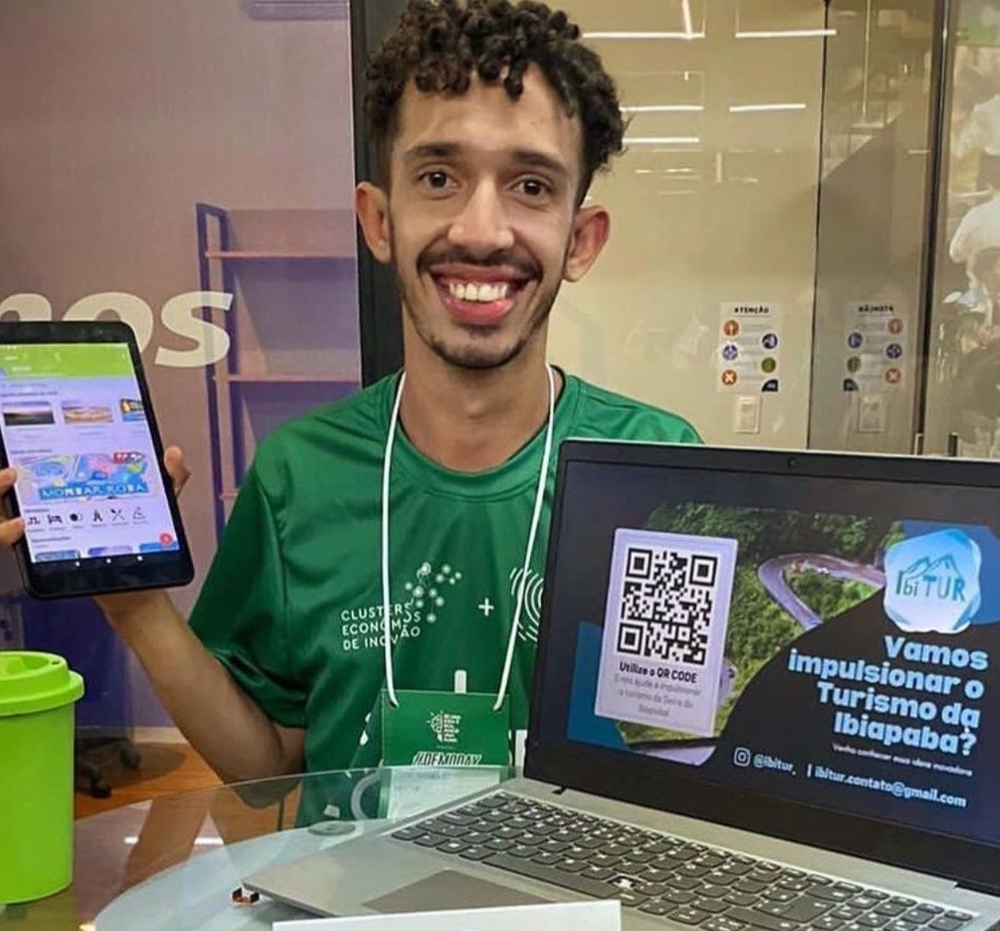
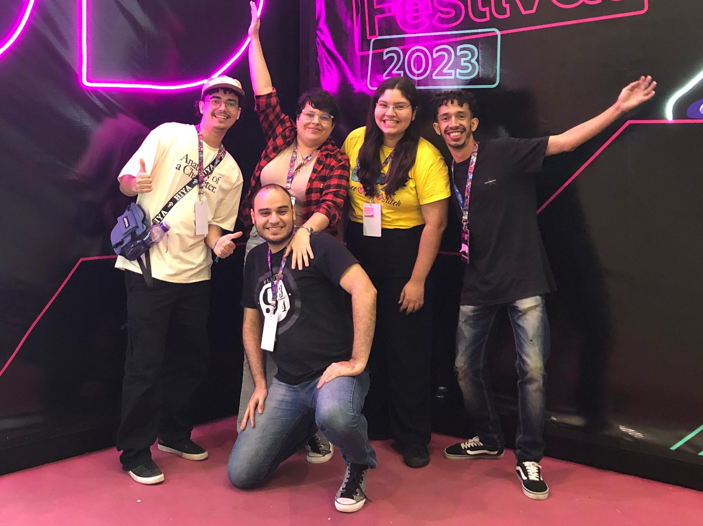
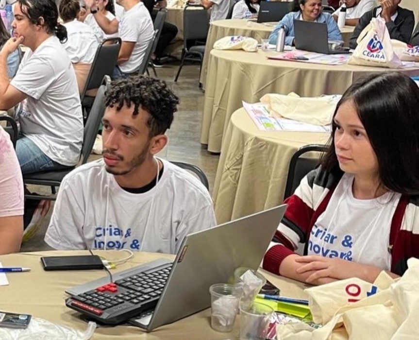

# José Roberto - Portfólio

Bem-vindo ao meu portfólio! Este repositório contém o código-fonte e os arquivos relacionados ao meu portfólio pessoal.

## Sobre mim

Me chamo José Roberto, sou um desenvolvedor web baseado em Guaraciaba do Norte, Ceará. Sou apaixonado por tecnologia, jogos e desenhos animados. Ao longo da minha jornada, trabalhei como desenvolvedor web, participei de projetos de inovação tecnológica e contribuí como voluntário em ONGs beneficentes.

## Habilidades

- Desenvolvimento web (HTML, CSS, JavaScript)
- Framework Django em Python
- Experiência em design de sites e sistemas
- Participação em eventos e hackathons

## Projetos Destacados

1. **Designs**
   - [Visualizar projeto](https://www.figma.com/file/SQsgpgfQajEs4ldCNwGf68/Untitled?type=design&node-id=0%3A1&mode=design&t=BkfSRHT6K36kmvlb-1)

2. **Registros**
   - [Visualizar projeto](https://www.figma.com/file/qT356uesEsMrFcUUpOEhHk/Free-Startup-%26-Work-Environment-3D-Character-(Community)?type=design&node-id=1%3A2&mode=design&t=RHajOgH3qt3G4ZW0-1)

3. **Projetos Back&Front End**
   - [Visualizar projeto](https://www.figma.com/file/m93QDdmn2Te7KMc1nKTR0h/Untitled?type=design&node-id=0%3A1&mode=design&t=nX8eRbSZOUE2WalQ-1)

## Eventos e Desafios

1. **Participação Demoday Cluster e Corredores Digitais**
   - Projeto Ibitur
   - 

2. **Hackton de Impacto & Festival Juventude Digital**
   - Time participante do Hackton de Impacto 2023
   - [Repositório do projeto](https://github.com/namartiinss/nlwEsportes)
   - 

3. **Desafio Startup SEBRAE**
   - Desafio Startup SEBRAE
   - [Repositório do projeto](https://github.com/namartiinss/traveler-gulliver-remaster)
   - 

## Contato

Se gostou do que viu, entre em contato comigo:

- Telefone: (88) 99819-6933
- E-mail: jose.roberto.carvalho07@aluno.ifce.edu.br
- [WhatsApp](https://wa.me/+558898196933?text=Ol%C3%A1!%20Vim%20pelo%20seu%20portf%C3%B3lio,%20podemos%20conversar?)

Até logo!
